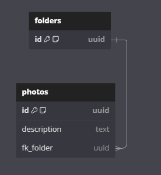

# Immobylette API Photo

## Contexte du projet

Ce repository s'inscrit dans le cadre du projet Immobylette qui vise à réaliser une application mobile android de réalisation d'état des lieux. Cette application métier doit pouvoir être utilisée par une agence immobilière. L'API Photo aura pour objectif de venir servir de service de stockage de photos.

## Architecture

### Tech stack du projet :

- Java **22**
- Maven
- Spring Boot

Librairies utilisées :

- Lombok
- Mapstruct
- Flyway
- Google Cloud Storage

L'architecture qui a été utilisée est celle des API REST accompagnée des standards d'API réalisée avec Spring Boot. Pour pouvoir venir stocker les photos, nous allons stocker les informations des photos au sein d'une base de données ayant le MLD suivant : 



Puis les photos seront sauvegardées au sein d'un bucket GCP où le nom de l'objet sera : `{folder_id}/{image_id}`

## Fonctionnement

### Authentification

Pour ajouter de la sécurité, l'authentification est basée sur la présence du header `X-Api-Key` dont la valeur doit être la même que la variable **API_KEY** du fichier application.yml

### Récupération des photos

Etant donné que nous stockons dans le bucket GCP, des photos de biens/mobiliers, nous ne souhaitons pas que ces informations soient publiques. Le bucket est donc privé. Ainsi les urls qui nous permettent d'accéder aux photos du bucket sont des urls signées qui ne sont que temporaires.

### Endpoints

- GET /folders/{id}/photos

Récupération d'une photo d'un dossier

- GET /folders/{id}

Récupération des informations d'un dossier

- POST /folders

Upload d'une liste de photos pour créer un nouveau dossier

- GET /photos/{id}

Récupération d'une photo se situant à la racine du bucket

- GET /photos/{folderId}/{photoId}

Récupation d'une photo au sein d'un dossier

## Build de l'application

### Pré-requis

Pour que l'application fonctionne correctement, plusieurs choses sont à paramétrer. Il faut premièrement fournir le fichier `src/main/resources/immobylette-credentials.json` qui contiendra les credentials GCP nécessaires à la connexion.

Deuxièmement, il va falloir modifier le fichier `Immobylette/immobylette--api-photo/src/main/resources/application.yml` :

- **DB_HOST** : host de la base de données
- **DB_PORT** : port de la base de données
- **DB_NAME** : nom de la base de données
- **DB_SCHEMA** : nom du schéma de la base de données
- **DB_USER** : username à utiliser
- **DB_PASSWORD** : mot de passe de l'utilisatteur à utiliser
- **GCP_PROJECT_ID** : id du projet GCP
- **GCP_BUCKET_NAME** : nom du bucket GCP
- **API_KEY** : clé d'api pour pouvoir utiliser l'API

Note : pour le bon fonctionnement du projet, il est nécessaire que l'API_KEY fournit ici ainsi que dans l'API Main soient les mêmes, sinon les deux API ne seront pas en mesure de communiquer entre elles.

Une fois toutes ces modifications faites, il est possible de build l'application

### Build

Pour générer le fichier .jar, il suffit simplement de lancer la commande suivante :

```bash
mvn clean install -DskipTests
```

### Build de l'image docker

Pour pouvoir build l'image docker, il faut exécuter la commande suivante : 

```bash
docker build -t latest .
```